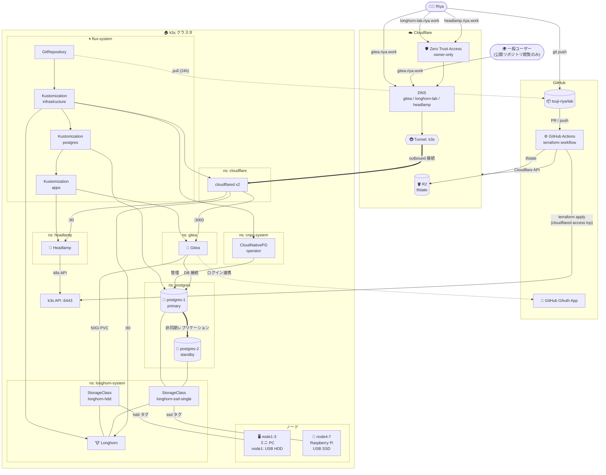
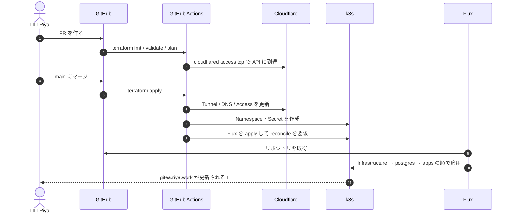
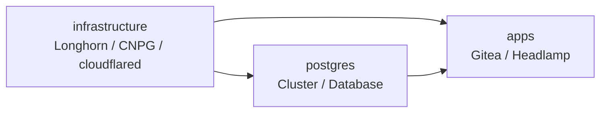

# 🐱 lab

おうちの k3s クラスタを GitOps で管理するリポジトリです 🐾
Terraform と Flux でほぼすべてをコード化していて、`main` に push すると自動で反映されます。

---

## 🖥️ ノード構成

| ノード | ハードウェア | ストレージ |
| --- | --- | --- |
| node1 | ミニ PC | USB SATA HDD 💿 |
| node2 | ミニ PC | - |
| node3 | ミニ PC | - |
| node4 | Raspberry Pi 🍓 | USB SATA SSD ⚡ |
| node5 | Raspberry Pi 🍓 | USB SATA SSD ⚡ |
| node6 | Raspberry Pi 🍓 | USB SATA SSD ⚡ |
| node7 | Raspberry Pi 🍓 | USB SATA SSD ⚡ |

- Longhorn のディスクは用途ごとにタグ分けしています。`ssd` は Raspberry Pi の USB SSD、`hdd` は node1 の USB HDD です。
- 大きなデータ(Gitea のリポジトリ)は HDD、書き込みの多い PostgreSQL は SSD に置きます。

---

## 🗺️ 全体構成図



---

## 🧩 構成要素

| レイヤー | 使っているもの | 役割 |
| --- | --- | --- |
| IaC | Terraform (`>= 1.9`) | Cloudflare・Namespace・Secret を管理 |
| tfstate | Cloudflare R2 (S3 互換) | Terraform の state 置き場 |
| GitOps | Flux CD | リポジトリの内容をクラスタへ同期 |
| Kubernetes | k3s | クラスタ本体 (ミニ PC 3 台 + Raspberry Pi 4 台) |
| ストレージ | Longhorn `1.12.1` | SSD / HDD の分散ブロックストレージ |
| データベース | CloudNativePG `0.29.1` | 共有 PostgreSQL クラスタ |
| 公開経路 | Cloudflare Tunnel (`cloudflared` x2) | ポート開放なしで外部公開 |
| 認証 | Cloudflare Access | Longhorn UI / Headlamp を自分だけに制限 |
| アプリ | Gitea (chart `12.7.0`) | セルフホストの Git サービス |
| アプリ | Headlamp (chart `0.45.0`) | Kubernetes の Web UI |

---

## 🌐 公開しているサービス

| ホスト名 | 転送先 | アクセス制限 |
| --- | --- | --- |
| `gitea.riya.work` | `gitea-http.gitea:3000` | 未ログインで公開リポジトリを閲覧可。新規登録は無効 |
| `longhorn-lab.riya.work` | `longhorn-frontend.longhorn-system:80` | Cloudflare Access (`owner-only`) |
| `headlamp.riya.work` | `headlamp.headlamp:80` | Cloudflare Access (`owner-only`)。ログイン不要の閲覧専用 (Secret は見えない) |
| `lab-k3s-api.riya.work` | k3s API `:6443` | CI が Access のサービストークン経由で利用 |

---

## 💾 ストレージ

| StorageClass | ディスク | レプリカ | 用途 |
| --- | --- | --- | --- |
| `longhorn-ssd-single` ⚡ | `ssd` (Raspberry Pi の USB SSD) | 1 (`strict-local`) | PostgreSQL。レプリケーションは CNPG 側で行う |
| `longhorn-hdd` 💿 | `hdd` (node1 の USB HDD) | 1 | Gitea のリポジトリデータ (50Gi) |

Longhorn のデフォルトディスクは `ssd` のものだけに絞っています。

---

## 🐘 PostgreSQL (共有クラスタ)

- `postgres` namespace にプライマリとスタンバイの 2 台を置き、非同期レプリケーションします
- Pod Anti-Affinity で別ノードに分散し、`etcd` ロールのノードに配置します
- `wal_compression` と `checkpoint_timeout: 15min` で WAL の量を抑えます
- アプリごとのロールと DB は `infrastructure/postgres/` に追加します (今は `gitea` のみ)

---

## 🔄 デプロイの流れ



### Flux の依存関係



CNPG の CRD は `infrastructure` の HelmRelease が入れるため、`Cluster` は別の Kustomization に分けて後から適用しています。

---

## 📁 ディレクトリ構成

```text
lab
├── .github/workflows/terraform.yaml   # CI: plan / apply / Flux 適用
├── fluxcd/                            # Flux 本体と Kustomization 定義
│   ├── flux-system/
│   ├── infrastructure.yaml
│   ├── postgres.yaml
│   └── apps.yaml
├── infrastructure/                    # 基盤コンポーネント
│   ├── longhorn/                      # ストレージと StorageClass
│   ├── cnpg/                          # CloudNativePG operator
│   ├── postgres/                      # 共有 PostgreSQL クラスタ
│   └── cloudflare/                    # cloudflared Deployment
├── apps/
│   ├── gitea/                         # Gitea HelmRelease
│   └── headlamp/                      # Headlamp HelmRelease
└── terraform/
    ├── cloudflare/                    # Tunnel / DNS / Access
    ├── kubernetes.tf                  # Namespace と Secret
    └── ...
```

---

## 🔐 シークレットの扱い

- DB と管理者のパスワードは Terraform の `random_password` で生成し、Kubernetes Secret として配置します
- Tunnel トークンも Terraform が作って Secret に格納します
- Git には平文のシークレットを置かず、CI の GitHub Secrets 経由で渡します

---

## ➕ アプリを追加するには

1. DB が必要なら `infrastructure/postgres/` にロールと `Database` を追加
2. `terraform/kubernetes.tf` に Namespace と Secret を追加
3. `apps/<name>/` に HelmRelease などを置いて `apps/kustomization.yaml` に登録
4. 外部公開するなら `terraform/cloudflare/tunnel.tf` と `dns_record.tf` にホスト名を追加
5. PR を作ってマージすれば完了です 🐱

---

Made with 💖 and 🐈 🐈‍⬛
